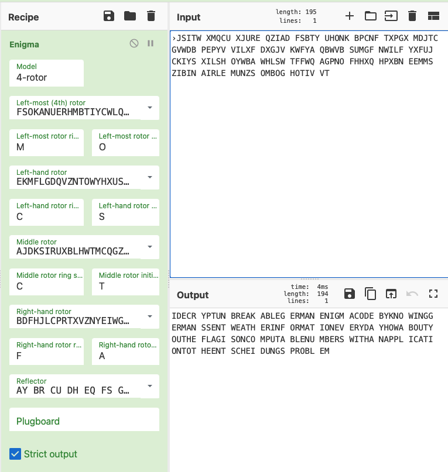

# UMCTF2021 - WWII

- Write-Up Author: Bon \[[MOCTF](https://www.facebook.com/MOCSCTF)\]

- Flag:mocsctf{ONCOMPUTABLENUMBERSWITHANAPPLICATIONTOTHEENTSCHEIDUNGSPROBLEM}

## **Question:**
WII

[chall](./chall)

## Write up
**below tool required in this article.**  
[cyberchef](https://gchq.github.io/CyberChef/) - TThe Cyber Swiss Army Knife  
[Enigma machine](https://en.wikipedia.org/wiki/Enigma_machine)  

---

go to [cyberchef](https://gchq.github.io/CyberChef/) and choose enigma

with below parameter

>M4 GAMMA MO CS CT FA 

decrypted as:  
>IDECR YPTUN BREAK ABLEG ERMAN ENIGM ACODE BYKNO WINGG ERMAN SSENT WEATH ERINF ORMAT IONEV ERYDA YHOWA BOUTY OUTHE FLAGIS ONCOMPUTABLENUMBERSWITHANAPPLICATIONTOTHEENTSCHEIDUNGSPROBLEM  

