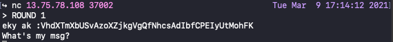

# UMCTF2021 - caesars army

- Write-Up Author: RB916120 \[[MOCTF](https://www.facebook.com/MOCSCTF)\]

- Flag:MOCSCTF{y0u_c4n_d3cryp7_f4573r_4nd_f4573r~~}

## **Question:**
caesars army

## Write up
**below tool required in this article.**  
[Caesar Cipher](https://www.dcode.fr/caesar-cipher)  

---

It is simple caesar cipher but we need to do this multiply times..
  

and with a simple script to get the flag
```python
#!/usr/bin/env python3
import string
from pwn import *

flag = open('flag.txt','rb').read()
lc = string.ascii_lowercase
uc = string.ascii_uppercase

def rot_n(s,n):
	return str.translate(s, str.maketrans(lc + uc,lc[n:] + lc[:n] + uc[n:] + uc[:n]))

conn = remote('172.17.0.2',9999,level='error')
round=1
conn.recvuntil("\n")
try:
	while True:
		chall = conn.recv(4096).strip().decode().split("\n")[0]
		print(repr(chall))
		for i in range(27):
			ans = rot_n(chall,i)
			if "msg is" in ans:
				conn.sendline(ans)
				print(ans)
		round+=1
		conn.recvuntil("ROUND "+str(round)+"\n")
		input("pause..")
except:
	print("###########################\n"*2)
	print(conn.recv())
```
