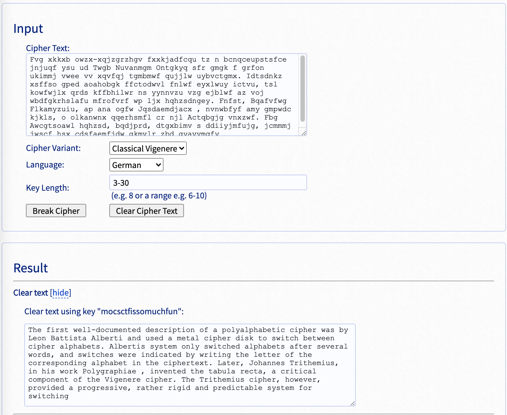

# UMCTF2021 - vigenere

- Write-Up Author: Bon \[[MOCTF](https://www.facebook.com/MOCSCTF)\]

- Flag:mocsctf{mocsctfissomuchfun}

## **Question:**
vigenere

>I don't think this question can beats you, am I right? ;)  
>
>Fvg xkkxb owzx-xqjzgrzhgv fxxkjadfcqu tz n bcnqceupstsfce jnjuqf ysu ud Twgb Nuvanmgm Ontgkyq sfr gmgk f grfon ukimmj vwee vv xqvfqj tgmbmwf qujjlw uybvctgmx. Idtsdnkz xsffso gped aoahobgk ffctodwvl fnlwf eyxlwuy ictvu, tsl kowfwjlx qrds kffbhilwr ns yynnvzu vzg ejblwf az voj wbdfgkrhslafu mfrofvrf wp ljx hqhzsdngey. Fnfst, Bqafvfwg Flkamyzuiu, ap ana ogfw Jqsdaemdjacx , nvnwbfyf amy gmpwdc kjkls, o olkanwnx qqerhsmfl cr njl Actqbgjg vnxzwf. Fbg Awcgtsoawl hqhzsd, bqdjprd, dtgxbimv s ddiiyjmfujg, jcmmmj jwscf hsx cdsfaemfjdw gkmvlr zbd gyavvmqfy

[chall](./chall)

## Write up
**below tool required in this article.**  
[vigenere cipher](https://en.wikipedia.org/wiki/Vigen%C3%A8re_cipher)  
[vigenere-solver](https://www.guballa.de/vigenere-solver) - online tool breaks Vigenère ciphers without knowing the key

---

use [vigenere-solver](https://www.guballa.de/vigenere-solver) to directly break the cipher.

find hint at the end of the article. "Please use the key as the flag."
The key of the cipher is moctfissomuchfun, so the flag is 
mocsctf{mocsctfissomuchfun}

