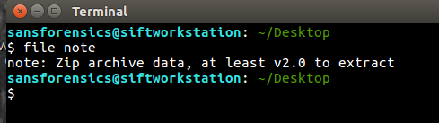
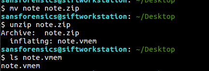
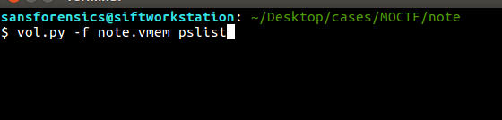
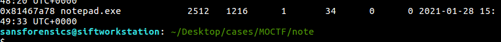
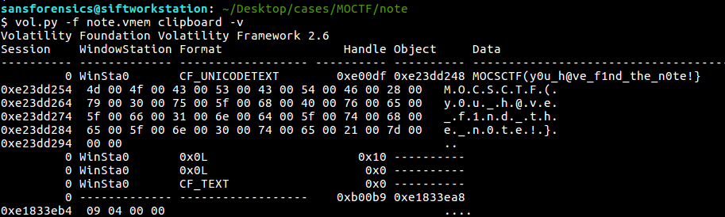
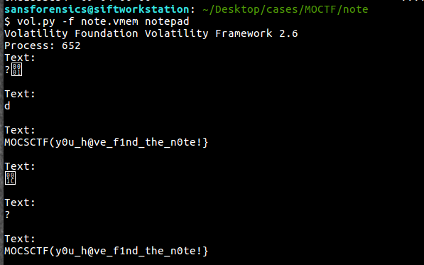

# MOCTF - Note

- Write-Up Author: Simon Leung \[[MOCTF](https://www.facebook.com/MOCSCTF)\]

- Flag:MOCSCTF{y0u_h@ve_f1nd_the_n0te!}

## **Question:**
> Note

[note](./note)

## Write up
**below tool required in this article.**  
[volatility](https://github.com/volatilityfoundation/volatility) - An advanced memory forensics framework. 

---
### 1. Identify the file:

### 2. Unzip the file:

### 3. Use Volatility Framework to analyze the file:
Use pslist to list the process

### 4. Found some interesting process:
Found notepad.exe

### 5. Found the flag in clipboard:
Suppose the user was editing via notepad, it is likely that the user has some info copied
and it should be found in the clipboard.

Try the clipboard parsing function of Volatility Framework to find the flag

Or use "notepad" option of Volatility Framework to reveal the content of the notepad process

