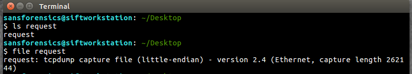
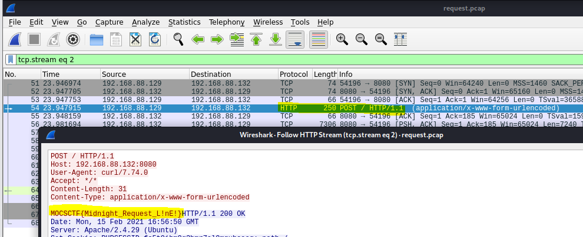

# MOCTF - Request

- Write-Up Author: Simon Leung \[[MOCTF](https://www.facebook.com/MOCSCTF)\]

- Flag:MOCSCTF{Midnight_Reqeust_L!nE!}

## **Question:**
> Request

[reqeust](./request)

## Write up
**below tool required in this article.**  
[Wireshark](https://www.wireshark.org/news/) - Wireshark is the world's foremost and widely-used network protocol analyzer.  

---
### 1. Identify the file:
It is a Packet Capture file

### 2. Use Wireshark to anaylze the PCAP file:

