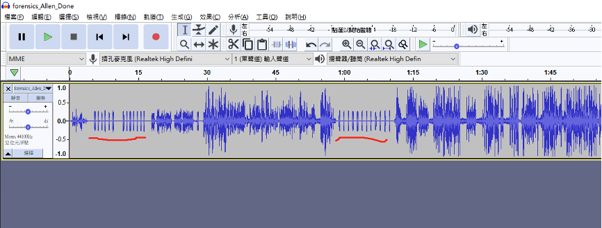
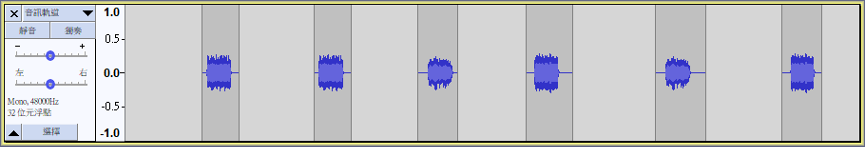
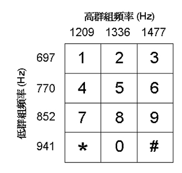
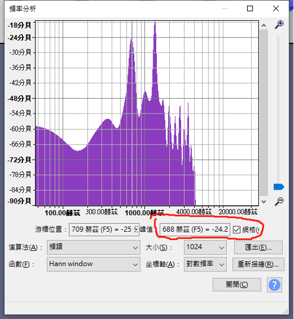
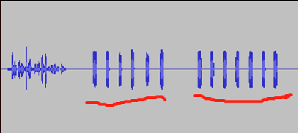
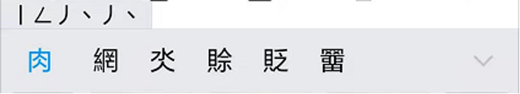
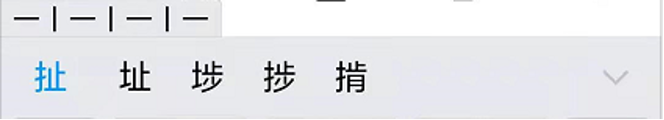
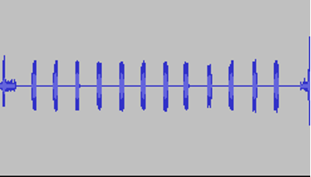
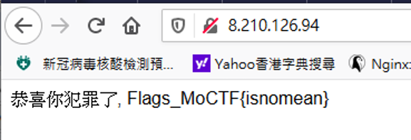

# UMCTF2021 - dialTone

- Write-Up Author: Allon \[[MOCTF](https://www.facebook.com/MOCSCTF)\]

- Flag:mocsctf{isnomean}

## **Question:**
dialTone

[audio](./audio.zip)

## Write up
**below tool required in this article.**  
[DTMF](https://en.wikipedia.org/wiki/Dual-tone_multi-frequency_signaling)

---
先聽一次所有內容，發現一個客服對話。
以往音頻CTF常用手法 修改MP3 或WAV 內容再作加密，如多聲道隱藏、頻譜圖隱藏、放大波形譜內含01、Mp3Stego、slienteye工具加密。
但以上通通不能使用，因為這是勾線操作，嫌犯之間不作後期聲音操作，一定是當時當下手機中隱藏訊息。
打開MP3 發現中間兩段按鍵聲有規律。  
  

 
發現按鍵聲用作傳遞
按鍵聲秘密
https://www.youtube.com/watch?v=48xx6H-M4ZI

 

第一段解密  
  
發現明顯分兩段 分按以上頻率作解開
２５３４３４  １２１２１２１
以手機輸入規律發現為筆劃輸入法

|T9 輸入法||
|--|--|
|网|２５３４３４|
|址|１２１２１２１|

  
  
  

找出第一代表為網址

第二段解密
第二段為12個字組成  
  
008210126094  

按第一段的提示為網址，作出以下猜想，找出Flag  
  
 
