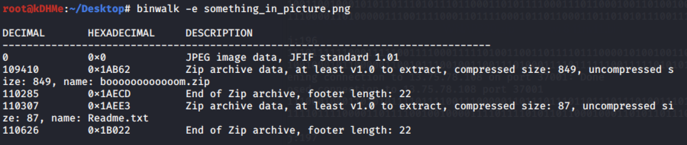
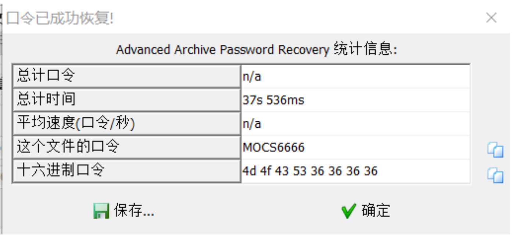
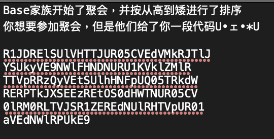
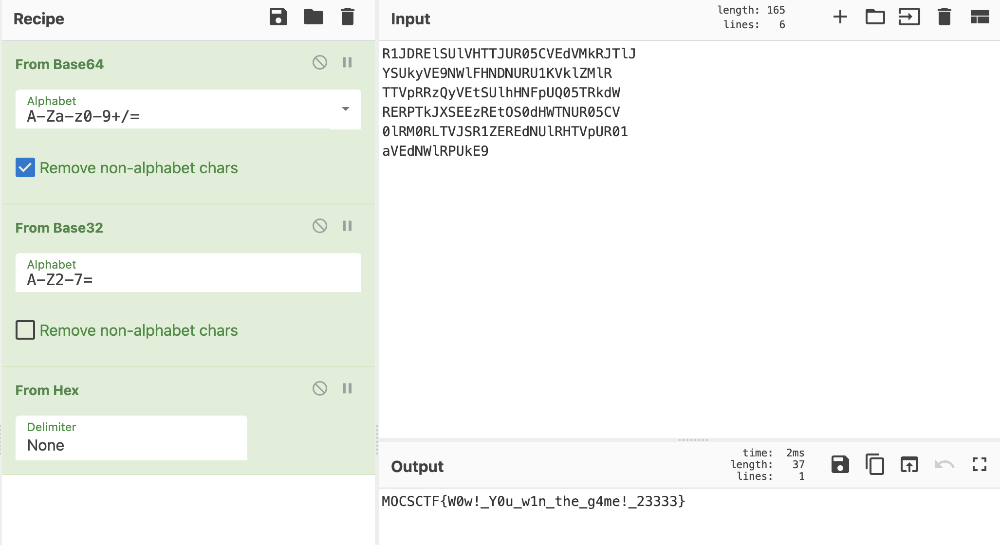

# UMCTF2021 - pic the zip

- Write-Up Author: P0tato \[[Merak天璇 20级](https://we.buptmerak.cn/)\]

- Flag:MOCSCTF{W0w!_Y0u_w1n_the_g4me!_23333}

## **Question:**
pic the zip

[picthezip](./picthezip.zip)

## Write up
**below tool required in this article.**  
[ARCHPR](https://www.elcomsoft.com/archpr.html) - Advanced Archive Password Recovery  
[binwalk](https://tools.kali.org/forensics/binwalk) - Binwalk is a tool for searching a given binary image for embedded files and executable code.  
[cyberchef](https://gchq.github.io/CyberChef/) - The Cyber Swiss Army Knife  

---

1. binwalk查看文件,提取得到新的文件
  
2. 查看Readme.txt中的提示，进行压缩包明文攻击
此处使用ARCHPR 4.54进行攻击
 
3. 对于flag.txt中的乱码进行base解码，根据提示可以得到顺序为: base64-->base32-->base16 得到
  
