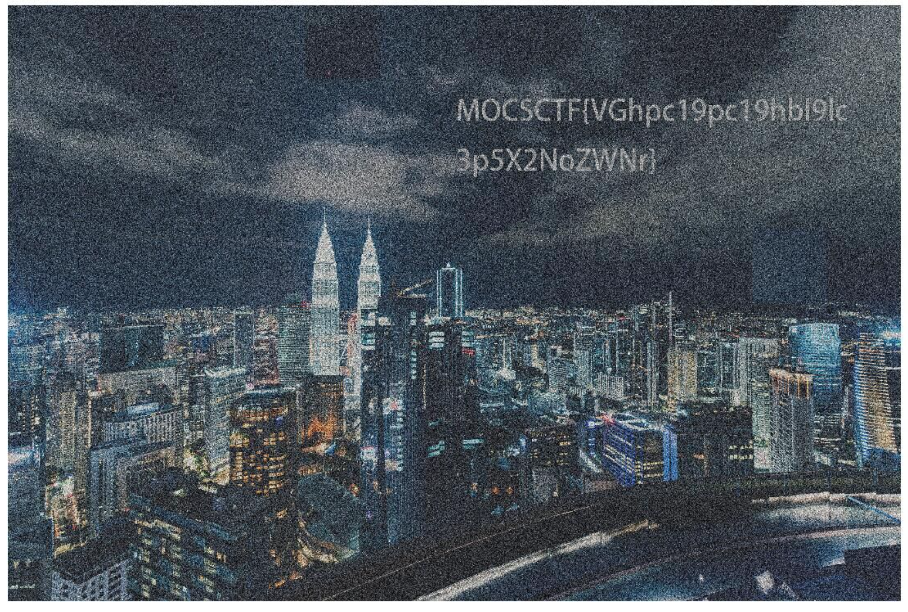

# UMCTF2021 - happy check

- Write-Up Author: P0tato \[[Merak天璇 20级](https://we.buptmerak.cn/)\]

- Flag:MOCSCTF{VGhpc19pc19hbl9lc3p5X2NoZWNr}

## **Question:**
happy check

[puzzle](./puzzle.png)

## Write up
**below tool required in this article.**  

[gaps](https://github.com/nemanja-m/gaps) - A QR code is a type of matrix barcode first designed in 1994 for the automotive industry in Japan. A barcode is a machine-readable optical label that contains information about the item to which it is attached.

---
解法一:
套用gaps(搬下来大佬的代码:https://github.com/nemanja-m/gaps 可得到以下结果

解法二:
纯 手 拼。 此法旨在促进亲朋好友协作，增进友情，促进亲情，是您居家生活的不二之选