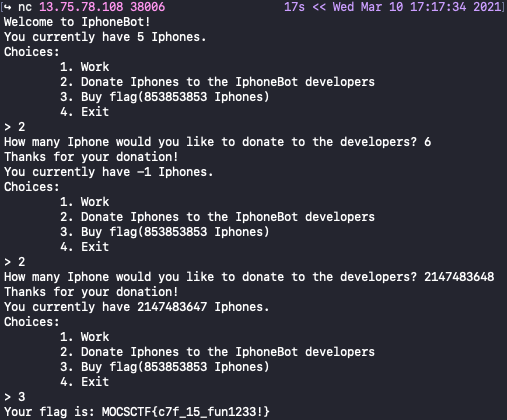

# UMCTF2021 - Iphone bot

- Write-Up Author: T4rn \[[MOCTF](https://www.facebook.com/MOCSCTF)\]

- Flag:MOCSCTF{c7f_15_fun1233!}

## **Question:**
Iphone bot

[iphone](./bin/iphone)

## Write up
**below tool required in this article.**  

[Integer overflow](https://en.wikipedia.org/wiki/Integer_overflow) - In computer programming, an integer overflow occurs when an arithmetic operation attempts to create a numeric value that is outside of the range that can be represented with a given number of digits – either higher than the maximum or lower than the minimum representable value.

---


简单的整型溢出 在捐赠的地方没有进行限制 当你所剩的钱数超出int类范围即可得到足够的钱

from c document.
```
Type	Storage size	Value range
int	2 or 4 bytes	-32,768 to 32,767 or -2,147,483,648 to 2,147,483,647
```
所以只要iphones donate 大於（2,147,483,647）即可溢出
