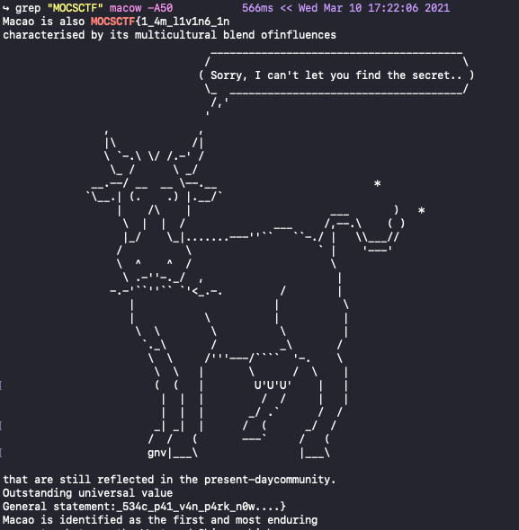

# UMCTF2021 - macow

- Write-Up Author: RB916120 \[[MOCTF](https://www.facebook.com/MOCSCTF)\]

- Flag:MOCSCTF{1_4m_l1v1n6_1n_534c_p41_v4n_p4rk_n0w....}

## **Question:**
Macow

[macow](./macow.zip)

## Write up
**below tool required in this article.**  

[grep](https://man7.org/linux/man-pages/man1/grep.1.html) - grep searches for PATTERNS in each FILE.

---

basic linux command, search the flag format in the file  

extend read:  
https://www.exmoo.com/article/134147.html