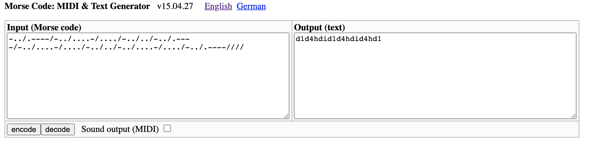

# UMCTF2021 - Mo talking to Res

- Write-Up Author: RB916120 \[[MOCTF](https://www.facebook.com/MOCSCTF)\]

- Flag:MOCSCTF{d1d4hdid1d4hdid4hd1}

## **Question:**
Mo talking to Res

>Mo:"Dah-di-dit di-dah-dah-dah-dah dah-di-dit di-di-di-di-dah di-di-di-dit dah-di-dit di-dit dah-di-dit di-dah-dah-dah-dah dah-di-dit di-di-di-di-dah di-di-di-dit dah-di-dit di-dit dah-di-dit di-di-di-di-dah di-di-di-dit dah-di-dit di-dah-dah-dah-dah"
>
>Res:"hey. that is fun.."
>
>please submit the flag with below format: MOCSCTF{flag}

## Write up
**below tool required in this article.**  

[Morse code](https://en.wikipedia.org/wiki/Morse_code) - Morse code is a method used in telecommunication to encode text characters as standardized sequences of two different signal durations, called dots and dashes or dits and dahs

---

use online translator  
http://www.robertecker.com/hp/research/morse-generator.php?lang=en

verbally:
Dah-di-dit di-dah-dah-dah-dah dah-di-dit di-di-di-di-dah di-di-di-dit dah-di-dit di-dit dah-di-dit di-dah-dah-dah-dah dah-di-dit di-di-di-di-dah di-di-di-dit dah-di-dit di-dit dah-di-dit di-di-di-di-dah di-di-di-dit dah-di-dit di-dah-dah-dah-dah.
