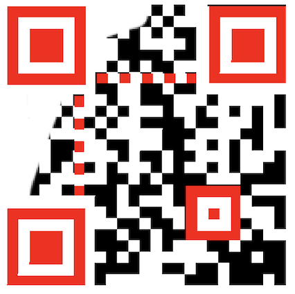

# UMCTF2021 - qr marsk

- Write-Up Author: bluebear \[[MOCTF](https://www.facebook.com/MOCSCTF)\]

- Flag:MOCSCTF{R3c0v3r_@r_C0de}

## **Question:**
qr marsk

[qr-code-challenges](./qr-code-challenges.png)

## Write up
**below tool required in this article.**  

[QR code](https://en.wikipedia.org/wiki/QR_code) - A QR code is a type of matrix barcode first designed in 1994 for the automotive industry in Japan. A barcode is a machine-readable optical label that contains information about the item to which it is attached.

---
* The first step in decoding the QR code was to bring it into Adobe Photoshop and recreate it digitally. 
* The red section of QR code is used for alignment. That's the important type of data. (Refer to "red section.png")  
* After recreate the red section, the broken QR code will be recovered.
* You will get the flag **MOCSCTF{R3c0v3r_@r_C0de}**
