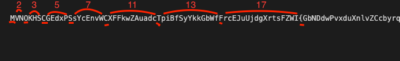

# UMCTF2021 - pain text

- Write-Up Author: RB916120 \[[MOCTF](https://www.facebook.com/MOCSCTF)\]

- Flag:MOCSCTF{y0u_c4n_533_pr1m3_n0w3321?}

## **Question:**
Break my shield

[shield.zip](./shield.zip)

## Write up

---

1. read the file, the flag is padding with prime lenght each charater.


let drop the code and speed up the things.  
```python
chall_out =[]
chall = "MVNOKHSCGEdxPSsYcEnvWCXFFkwZAuadcTpiBfSyYkkGbWfFrcEJuUjdgXrtsFZWI{GbNDdwPvxduXnlvZCcbyrqbSmHlTTbxnkPLxenfFUXz0aIUAjmftxRQuvZPFTQwIMbENWOgghuZYSxFDfcRrzkkyovMixzHExpkAdpgab_QZFPMzPRzDhBuKqXpTZupmwmjxZJtcXCfliXycQgFOoQHjMzwmnAGklXTQpQpOorCzvNwQnWwudJphS4bItwqxRPjgQmZsXoJoDudmCRCfKAOdgfuWBRuGSJRzfnkckktbOFbPFUhsfOLvVCgtSSNRRqbvCvnSUrRpwDEEtTLHz_xVxSVTgxjIjjKJLQhicECzavIgLoHCExourDPLlrLfrmGdabjoiTk5WQqSyjSMjmENKJHaQZqxLanSZWoSFMxEMrICRZbkiKytvxjAITBiGnAIaND3BOtHajsFZjduZsPlnrpKSmqohKEOvevpvpvdIcILLlDJYjggTsZTHrkJCDRCH3UfuqqeVsuAEhNAXbQLVPcMAcFUjtfqoGJwdyAcZQkdZijGGgUTXNwEVAMNsGzUQGsFp_XMjbRVHjSEwfKOOHFtyKmMfViPQewMKslgYvwJPdgiNulOCktVMnlNwxPVsiVlAhkowQydgpTBAuDXlViySfeBUJfaxxbyfVYgGrlXUOOuNOGsRaBgYzbnvMcayZeZjbLWvTViXoZrHGsmLcCrmlINHZrwelNuPmGzmAwiQwnLEYpHhAFTYzzkiIXIDndIBYfrXgmOoeqxiKkEEgHoBbusXyfpqMmMKCi1oFPEucltKZhIYrfuKZceluARvKJTIxVEBoesheEZYyQbvfMJJixcJnKwtZKRkvhxzAJSKEloqFhRdpNkoJwmiavvKeOeMZaSOGwaMRUrXJrDcaQgdvsHdVxMpfVScGVGzdeFWzmjQVmSAKkaRRbLPEdwqsQvIRUJHzQgDMCbRIwVy3PoykpmBqWBvhJFhBaQDEYyuPTrvHauBIRFrcmgUYoMqQeHNALvxvqmyVgeLJbTgKMIRXUScsmrOOZPFQNSoEYpNyPYiHEswba_FyxbkKYfOGKlFDrkUyVzdiJhDJxMlRGmjibXqfuQAKvpSxsOVWYCOlVvUDGrmfnoduZMNQpRXrDuOOhypyLByvbNhjpoeoTlcLGkWnLiHynGeTMBTOoByWxrVYSsyuDgiKEJaiXpbYBQQVMakQbPYHpDyMUSfkVazOCnQscwBmJrQsFEPRAiMVmvajTKoKBtDlIfiTTQtFpjM0fKqyBUWClujBJNALFVuJbMzzySuYRJvDgrHXwpKiWbHXyhEqISQnwgKlgawyJFiXThPGWekSqBXorobZzYsZWnEFoiKOJdgAVwLXhHGsFHrwHGsvwkGBSKkQeIIHGotplpPkQAoZYiWSsnaLJTOIewEnUruvefOBnbkYEFezZwygQPZXUoLvVFROJGKeqiGLZiqstmNMeqTkIpuFKBrhYIbil3ydhXrNDxZDbZtYChztminNhOQFnICFxztCbPzVGhAmVMJsYpdXcqiAsZcbJnFJDUpVqNfHPKNRSUunsdEZoPFrYcszIbAasDScymVHSjkreAzrXlW3IuybisfprRSAvDfDeGAxYSOWPvaEPNrbCeVoBevjVogQMYQLZJEupawsAyKpzdZnGGrwAknSRNqaRzywRJJqklJFezOqCnjdGpKtOhHOICVygxJtNzhFIKAOLspqFxY2flsokUCqLLiQDMhNpewoBLgtRqIFWxrMHkklPxLVZEOhpGlrmYJPuzeDKShwxJKayUsIpfXhBpxKfXGmbgrEATDUrKtWhilqpfHDNcDBsbKfQPTXdfOrTSYYrSbAkXFSaxy1efmFliKxWBcyXtDeYLPMnXkVrhFqzKZtHaalgatnMDUTJfOfzWZCbKbtyLGgufkZnQGUhPxAvhxTKmbPPtqIXmQEfhpllZgUpPgWwrNjyzgedxXPKojHgzsLlARMeTcoSUflyqVlI?CVNCPUvSGIzOgleSZWIyohSCTWBGtbrUgBTUixRZtBfMdoZijiZmAMbHjUrusvdzTMXJkBzoJNbvNyRcFVlBqTznkVJttKwXmwlflYRmSyYmidTWdUgIOgxWzDtOdExLyJtYSmyEmlq}dVMQJDHabZZIjljeXatWLQJsyDAonpUGXkHfiGDOwCqQwgZTUjBjCASSdSzneMrSRdSnvDAqXLpfVWEUxXLgsUjSctcPOsItMvYPytLyeYvAjazrSSXAjMFWHsaxKhTcPNwoNcQZeazIRmScicDvRoTSMOCNaBeLGVHirQPuxAFrKPXcJNruJhaEyqwyaunHBzRhhGHnxjsQswFeCOqWtEHnekqEGvSwLBfvyFZQFhWAarkeXHoDNAUlHBgOCaSBKjMusnKqIpMAqnmdqsoDCjFtBsWHICFJVabOYvBapAZ"

for num in range(1, 150):

	if num > 1:
		for i in range(2, num):
			if (num % i) == 0:
				break
		else:
			#print(num)
			for j in range(0,num+1):
				if(j==0):
					chall_out.append(chall[j])
				elif j==num:
					chall = chall[num+1 : : ]

for i in chall_out:
	print(i,end='')
```