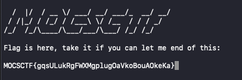
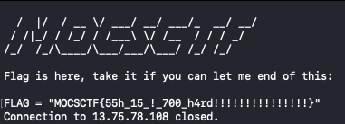

# UMCTF2021 - takeit

- Write-Up Author: RB916120 \[[MOCTF](https://www.facebook.com/MOCSCTF)\]

- Flag:MOCSCTF{55h_15_!_700_h4rd!!!!!!!!!!!!!!!}

## **Question:**
takeit

>i put the flag on the screen, take it if you can end the session

## Write up
**below tool required in this article.**  

[EOF](https://linuxhint.com/what-is-cat-eof-bash-script/) - This operator stands for the end of the file. 

---
the ssh session show a program running on the screen  
  
 
 
put ctrl-D then the program will return the flag.  
  

please share your way to solve this.:)