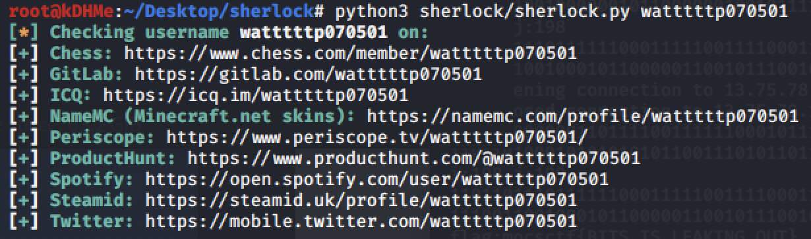
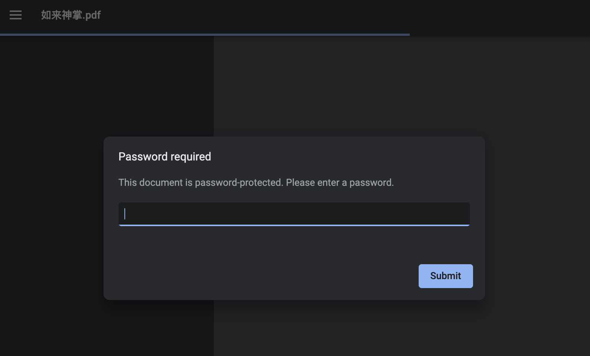
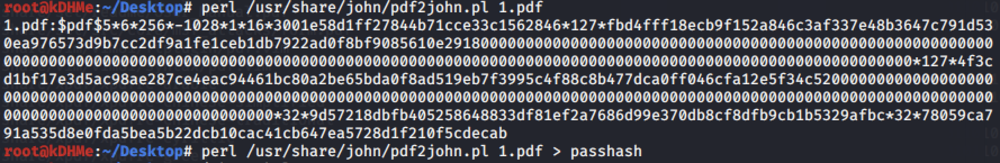
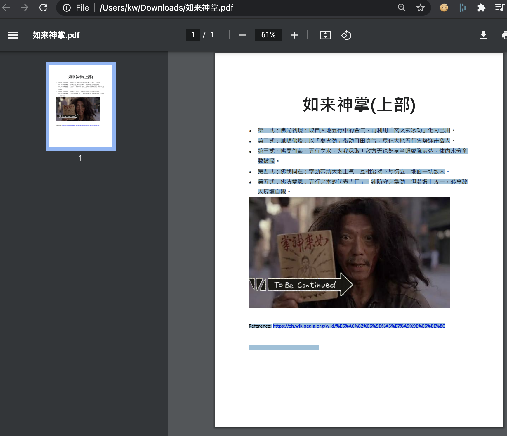

# UMCTF2021 - 抽水哥's 秘笈

- Write-Up Author: RB916120 \[[MOCTF](https://www.facebook.com/MOCSCTF)\]

- Flag:MOCSCTF{d0n7_u53_3z_p5wwd!!}

## **Question:**
抽水哥's 秘笈

>抽水哥's 秘笈 is post in a public page. please find 抽水哥's 秘笈.

## Write up
**below tool required in this article.**  

[git](https://git-scm.com/) - Git is a free and open source distributed version control system designed to handle everything from small to very large projects with speed and efficiency.  
[rockyou]() - rockyou wordlist is a password dictionary used to help to perform different types of password cracking attacks.  
[John the ripper](https://www.openwall.com/john/) - John the Ripper is an Open Source password security auditing and password recovery tool available for many operating systems.  

---

1. from sherlock result, there is a gitlab account.

2. go to github/gitlab find a repo and find there is file
  
but unforturnally, the file is encrypted.
   
3. we can use john the ripper brutefore password with rockyou(common password list)

 - first we have to convert the hash to john the ripper style

 - then run the John the rippper with rockyou worldlist

  password: watterson
4. open the pdf, flag is wrote with white color,

Flag:MOCSCTF{d0n7_u53_3z_p5wwd!!}