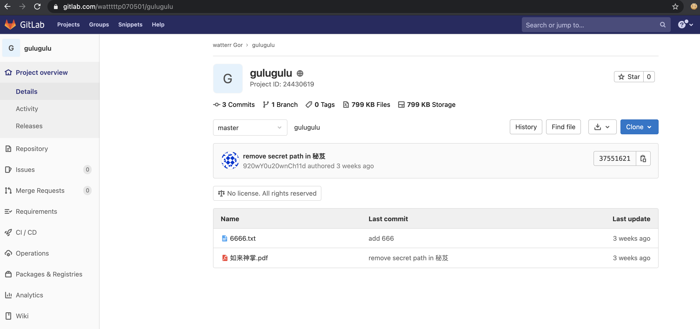
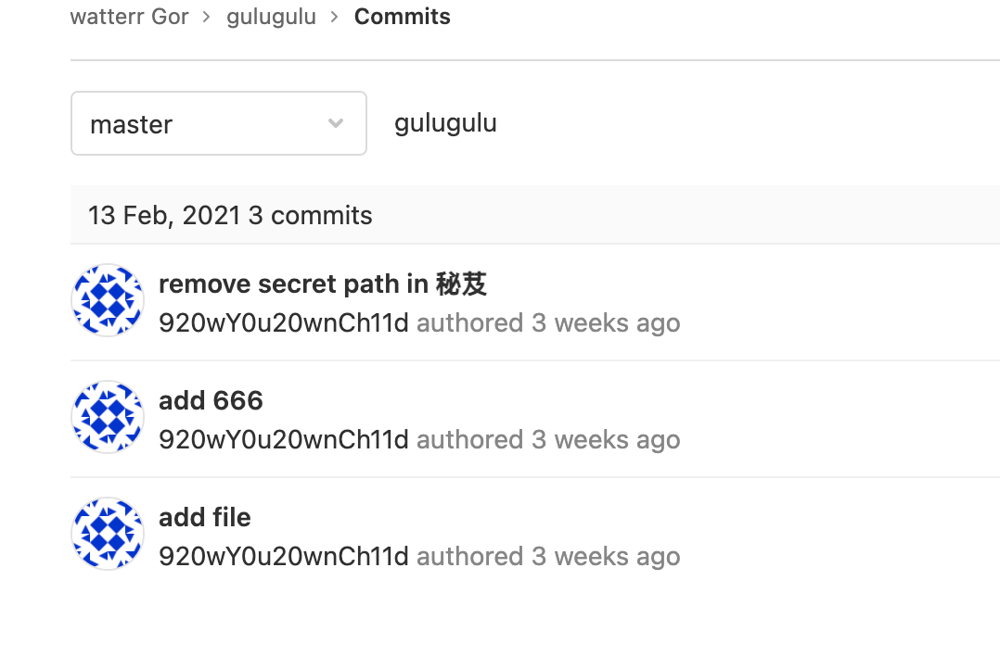
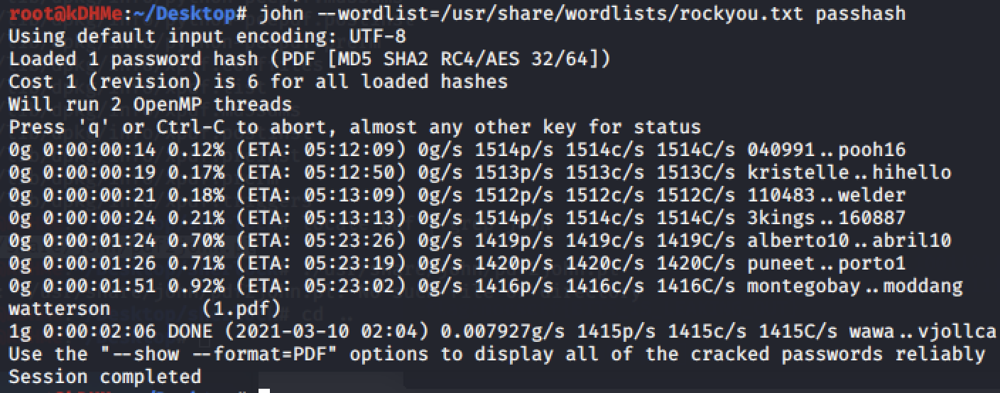
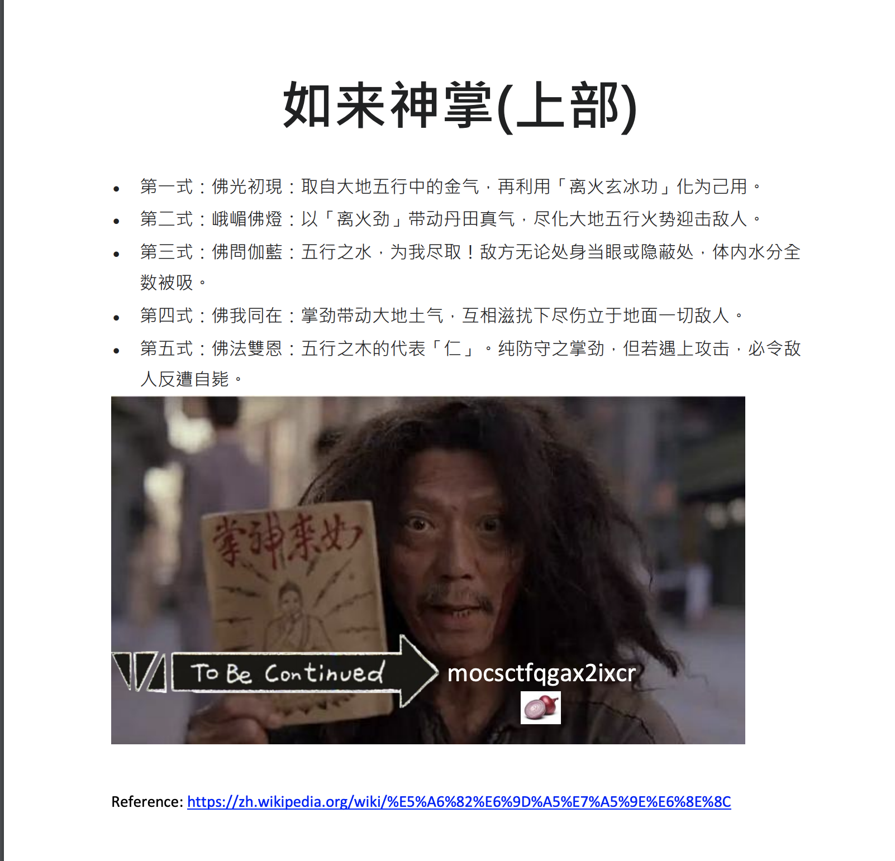
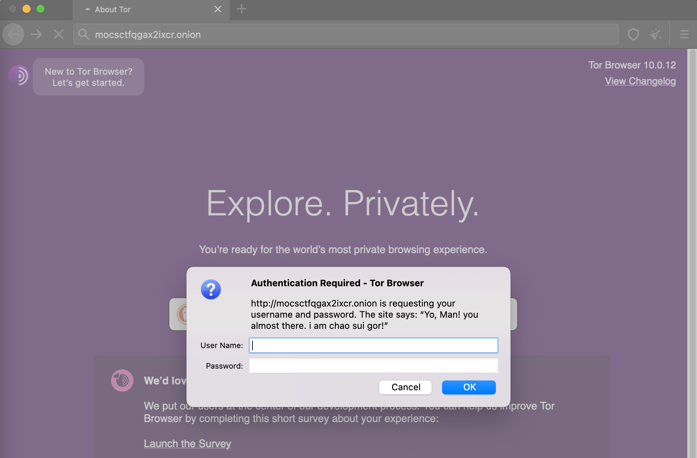
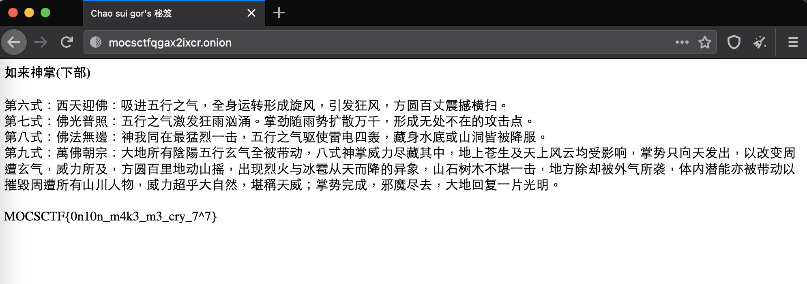

# UMCTF2021 - 抽水哥's 秘笈(下) on ION

- Write-Up Author: RB916120 \[[MOCTF](https://www.facebook.com/MOCSCTF)\]

- Flag:MOCSCTF{0n10n_m4k3_m3_cry_7^7}

## **Question:**
抽水哥's 秘笈(下) on ION

>抽水哥's 秘笈 is post in a public page. please find 抽水哥's 秘笈.

## Write up
**below tool required in this article.**  

[git](https://git-scm.com/) - Git is a free and open source distributed version control system designed to handle everything from small to very large projects with speed and efficiency.  
[rockyou]() - rockyou wordlist is a password dictionary used to help to perform different types of password cracking attacks.  
[John the ripper](https://www.openwall.com/john/) - John the Ripper is an Open Source password security auditing and password recovery tool available for many operating systems.  
[tor browser](https://www.torproject.org/) - Tor Browser prevents someone watching your connection from knowing what websites you visit  
[Tor/onion](https://en.wikipedia.org/wiki/Tor_(anonymity_network))  - Tor is free and open-source software for enabling anonymous communication by directing Internet traffic

---

1. from sherlock result, there is a gitlab account.

2. go to github/gitlab find a repo and find there is file and with serveral commit
 
  
download the pervious version of file,but unforturnally, the file is encrypted.
   
3. we can use john the ripper brutefore password with rockyou(common password list)

 - first we have to convert the hash to john the ripper style

 - then run the John the rippper with rockyou worldlist

  password: watterson

5. the file is little difference with latest version
  
there is a onion and the string??i think this is point to onion network(aka darkweb)

6. try to access http://mocsctfqgax2ixcr.onion/ with tor browser  
yeah! we can confrim that is we are looking for, but there require a username and password
  

7. concilidate the infomation we have. i notice the twitter account post a wechat qr code, but QR code is not vaild. try search the id watttttp070501.  
  
bingo!!  
 
  
- look at the wechat moment i find the a pic that showing a set of password

8. with a guess, username/password should be WATERR/0#@9$DQ
  
