# UMCTF2021 - Crackme

- Write-Up Author: James \[[Merak天璇 20级](https://we.buptmerak.cn/)\]

- Flag:MOCSCTF{cRa0k_M3_1s_s0_Ea3y!!!}

## **Question:**
Crackme  
[crackme.exe](./crackme.exe)
## Write up
[patch教程参考链接](https://blog.csdn.net/hgy413/article/details/50650232)  
[安全客](https://www.anquanke.com/post/id/208682)  
[隐藏线程](https://blog.csdn.net/Simon798/article/details/103161482)

---

这题主要考察选⼿动态调试。扔进exeinfope，32位exe，⽆壳  
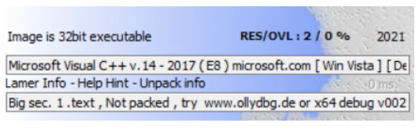  
main程序，点进sub_4017D0看  
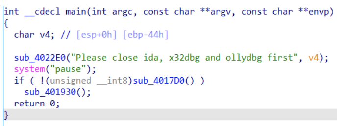  
sub_4017D0，可以看出是检测进程名称。找到for之前的汇编，尝试在动调的时候修改eip直接jmp到
CloseHandle，⼜或者是⾃⼰patch⼀下，防⽌return 1，从⽽反反调试。[patch教程参考链接](https://blog.csdn.net/hgy413/article/details/50650232)
（留意这⾥的dword_406120，之后会讲）  
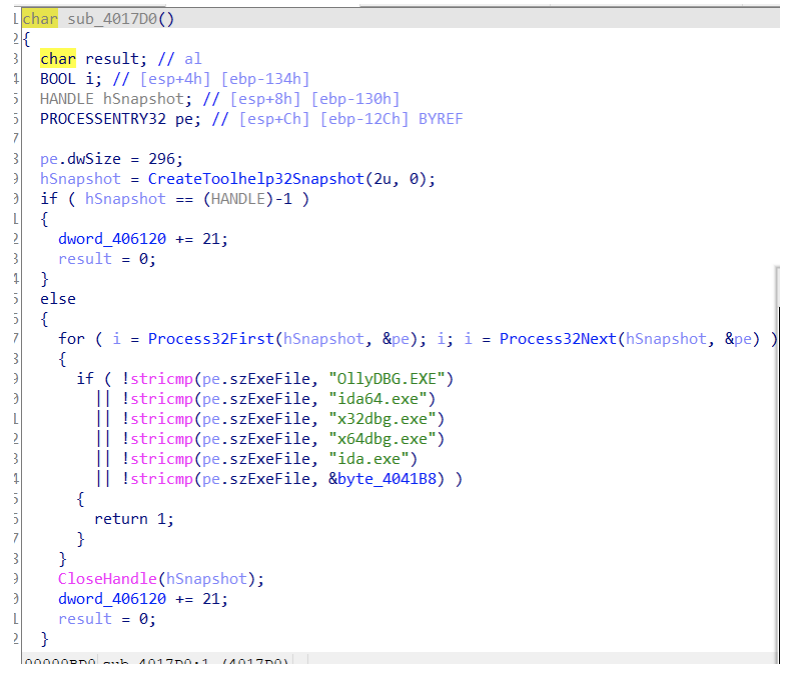  
sub_401930是个SEH异常反调试，可以参考源码  
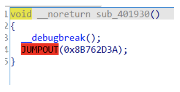  
直接查看汇编，参考刚刚上⾯的源码，反调试的E9刚好起到了花指令的作⽤，变成了jmp near ptr
8B762D3Ah。在jmp按⼀下U，在E9下⾯按c转为代码，然后再把E9 nop掉。  
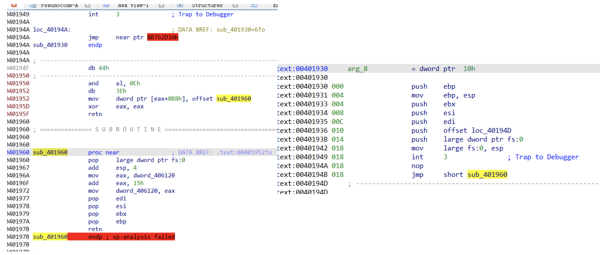  
没红⾊了那就F5⼀下，按两下进sub_401960（再留意⼀下dword_406120） 
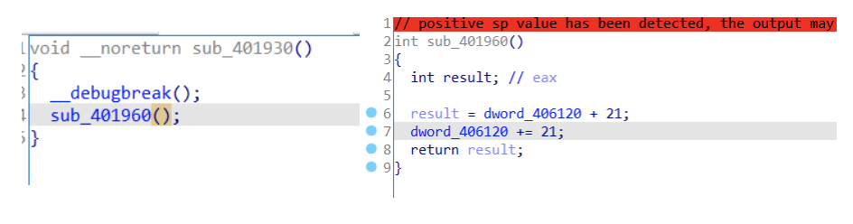  
返回到主函数的汇编，发现藏起来了⼀个函数sub_401FB0
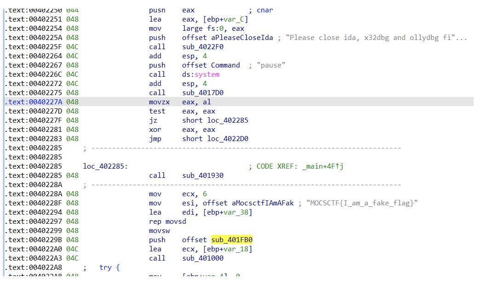  
⼜或者⽤shift+f12找到关键字符，对着Format按⼀下x键，找到调⽤的地⽅，然后再F5⼀下   
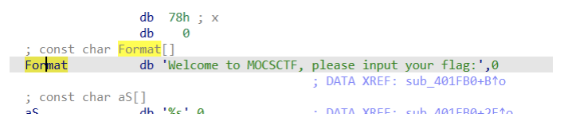  
找到了验证函数，先来看_Initialize_parallel_init_info函数  
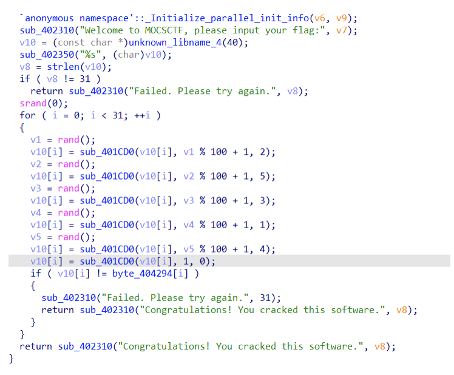  
发现了NtSetInformationThread，这整个函数是隐藏线程防⽌调试⽤的，参考[链接](https://blog.csdn.net/Simon798/article/details/103161482)，直接eip修改过就⾏
（再留意⼀下dword_406120）  
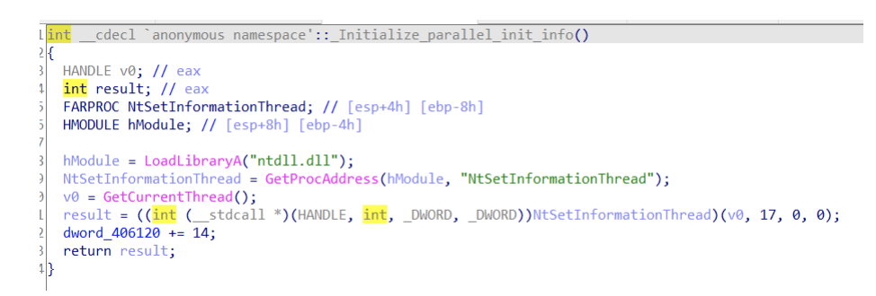  
再看主函数⾥⾯的加密函数sub_401CD0，可看出来应该是做了加密的函数，解密后动态调⽤  
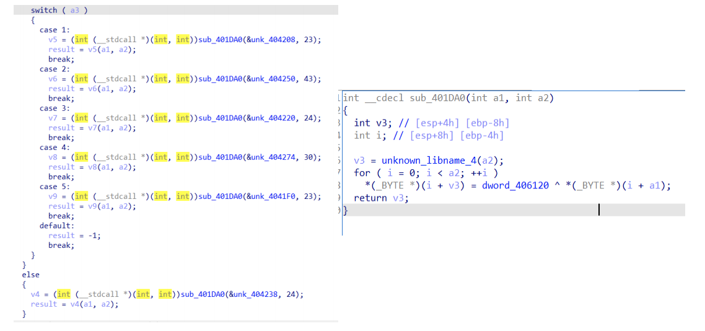  
发现是⽤之前看到的dword_406120解密的，当反调试函数都过了，让dword_406120+=了21,21,14，即
dword_406120(下⾯改成了unk_406120)为56时才解密成功，从⽽调⽤函数。
右键Jump in a new hex window ->找到15h右键Edit->改成38（即⼗进制56）再右键Apply
changes。  
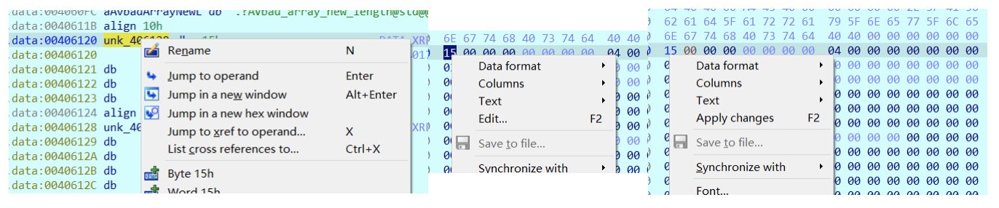  
成功解码之后再慢慢步⼊进加密函数，当中加了花指令，花指令可参考[安全客](https://www.anquanke.com/post/id/208682)  
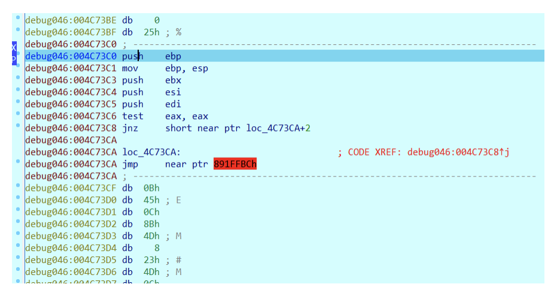  
我出题的时候发现有时候jnz没跳转，所以⼜加了test eax, eax
所以整个花指令模式如下
```c
__asm{
 test eax, eax
 __emit(0x75) //jnz $+4
 __emit(0x02)
 __emit(0xE9) //⼲扰IDA
 __emit(0xED)
 }
```

这个花指令和上⾯是同⼀个，⽤的E9，参考上⾯的做法patch⼀下，把E9，ED nop掉  
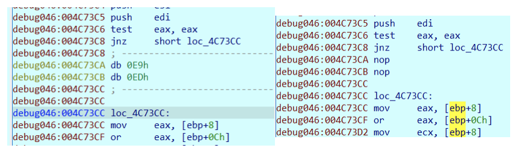  
在最上⾯的push ebp右键 create function，成功建⽴函数后就可以F5了，图⽚这个实际上就是异或运
算，都是按位运算，试⼀下就会发现是异或  
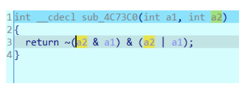  
以此类推，发现运算分别为加减乘除异或和取余66666（⼗六进制0x1046A，⼩彩蛋），其中除1等于没效
果，取余66666还是调⽤了rand，所以还原加密过程的时候还是要保留  
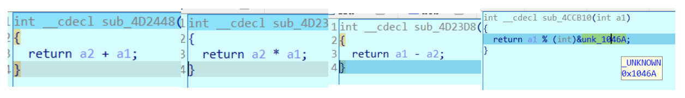  

可以看出可以单字节爆破，还原⼀次加密过程，再爆破就得到flag了（导出加密的数据不细说了，
shift+e）
```c
 #include<stdlib.h>
 #include<stdio.h>
 #include<iostream>

 #define rand100 rand()%100+1

 const char enflag[] = {
 0x0C,0x17,0x80,0x40,0x29,0x34,0x0C,0x29,0x28,0xA1,
 0x3A,0x80,0x82,0x1D,0x00,0x18,0xC3,0xCA,0x10,0x2E,
 0xD3,0x21,0x48,0xA5,0x3A,0x99,0xFB,0x46,0x0F,0xC6,
 0x78
 };

 void gen_rand(){
 srand(0);
 for(int i=0;i<31;i++){
 if(i%2==0)printf("\n");
 for(int j=0;j<5;j++){
 printf("0x%02X,",rand100);
 }
 }
 }

 const char random_list[] = {
 0x27,0x14,0x27,0x26,0x38,0x62,0x42,0x56,0x33,0x0D,
 0x36,0x01,0x2B,0x52,0x26,0x16,0x2E,0x56,0x62,0x51,
 0x4D,0x5C,0x38,0x07,0x3A,0x18,0x52,0x29,0x1A,0x4F,
 0x2F,0x5B,0x29,0x58,0x08,0x26,0x0C,0x12,0x39,0x44,
 0x22,0x4F,0x18,0x58,0x62,0x55,0x0D,0x0C,0x4F,0x43,
 0x1E,0x05,0x50,0x06,0x59,0x32,0x1E,0x4D,0x20,0x41,
 0x0F,0x25,0x1D,0x03,0x35,0x05,0x26,0x39,0x63,0x49,
 0x62,0x0E,0x54,0x04,0x3D,0x2B,0x30,0x4C,0x48,0x05,
 0x4A,0x35,0x14,0x05,0x28,0x57,0x05,0x26,0x18,0x24,
 0x22,0x5E,0x15,0x4B,0x54,0x3E,0x19,0x42,0x46,0x1F,
 0x44,0x25,0x32,0x25,0x14,0x1C,0x01,0x18,0x17,0x4B,
 0x0C,0x3F,0x42,0x5C,0x14,0x30,0x33,0x15,0x23,0x45,
 0x19,0x4E,0x2F,0x20,0x3B,0x49,0x1F,0x23,0x52,0x24,
 0x44,0x3D,0x0F,0x2B,0x4D,0x1C,0x18,0x5F,0x45,0x2D,
 0x19,0x16,0x08,0x61,0x1B,0x40,0x29,0x3F,0x30,0x51,
 0x30,0x1D,0x0E,0x54,0x3C
 };

 char encode(int input,int i){
 input ^= random_list[i*5];
 input += random_list[i*5+1];
 input *= random_list[i*5+2];
 input -= random_list[i*5+3];
 input %= 66666;
 return input&0xFF;
 }

 void brute(){
 for(int i=0;i<31;i++){
 for(int j=33;j<125;j++){
 if(encode(j,i) == enflag[i]){
 printf("%c",j);
 //break;
 }
 }
 printf("x");
 }
 }

 int main(){
 brute();
 }

```
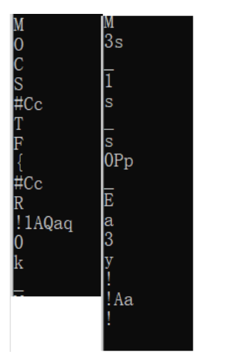  
**這裏可以多解
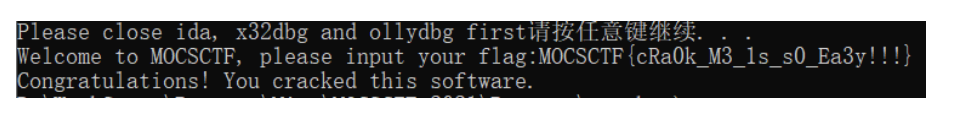