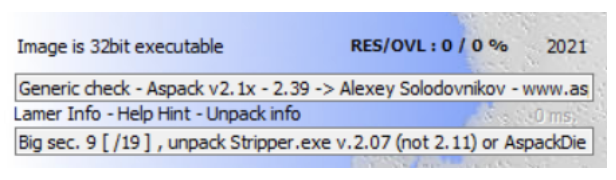
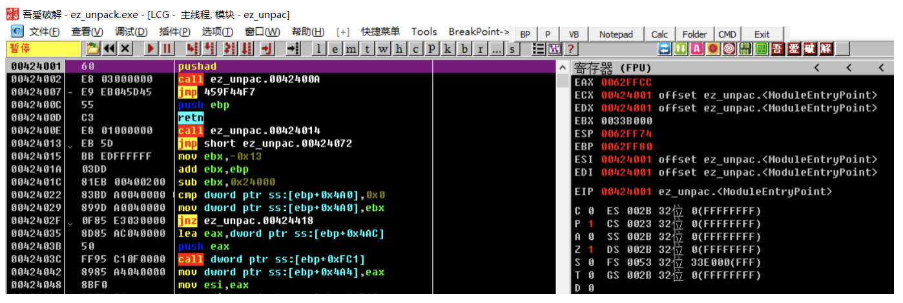
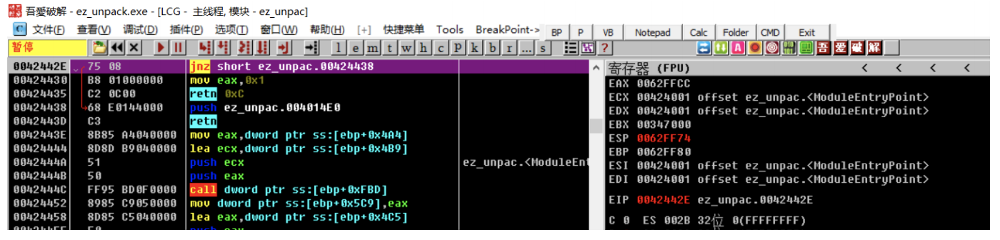
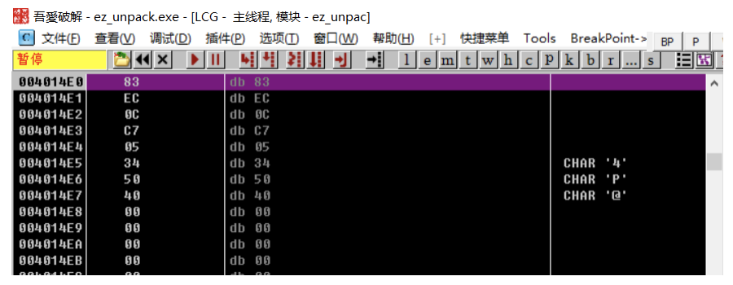
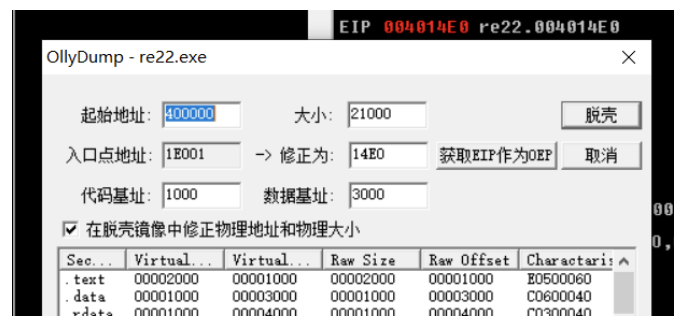
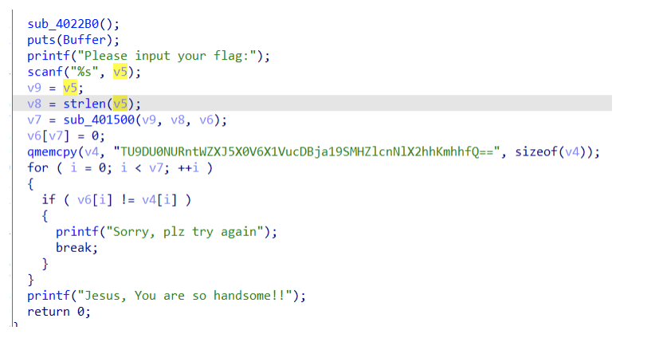

# UMCTF2021 - ez_unpack

- Write-Up Author: James \[[Merak天璇 20级](https://we.buptmerak.cn/)\]

- Flag:MOCSCTF{Very_Ez_Unp0ck_R0verse_ha*ha}

## **Question:**
ez_unpack  
[ez_unpack.exe](./ez_unpack.exe)
## Write up

---

扔进Exeinfo PE，32位exe，Aspack壳  
  
压缩壳⼀般都会⽤到pushad指令，ESP定律即可脱壳(当然实际上可以直接动调就能搞定)，进去按⼀下F8  
  
右键ESP寄存器然后选择断点，即HW break [ESP]，然后按⼀下F9  
  
再F8⼏下进⼊壳内的exe函数，然后就找到了程序真正的OEP  
  

OEP  
  
选择 插件->OllyDump，⾃动选择了当前EIP作为OEP，啥都不⽤选直接按脱壳，保存为dump.exe  
  
将脱好壳的程序放进ida，剩下的不细讲了，base64解码⼀下就是flag  

```python 
import base64
flag = "TU9DU0NURntWZXJ5X0V6X1VucDBja19SMHZlcnNlX2hhKmhhfQ=="

print(base64.b64decode(flag))
# MOCSCTF{Very_Ez_Unp0ck_R0verse_ha*ha}
```