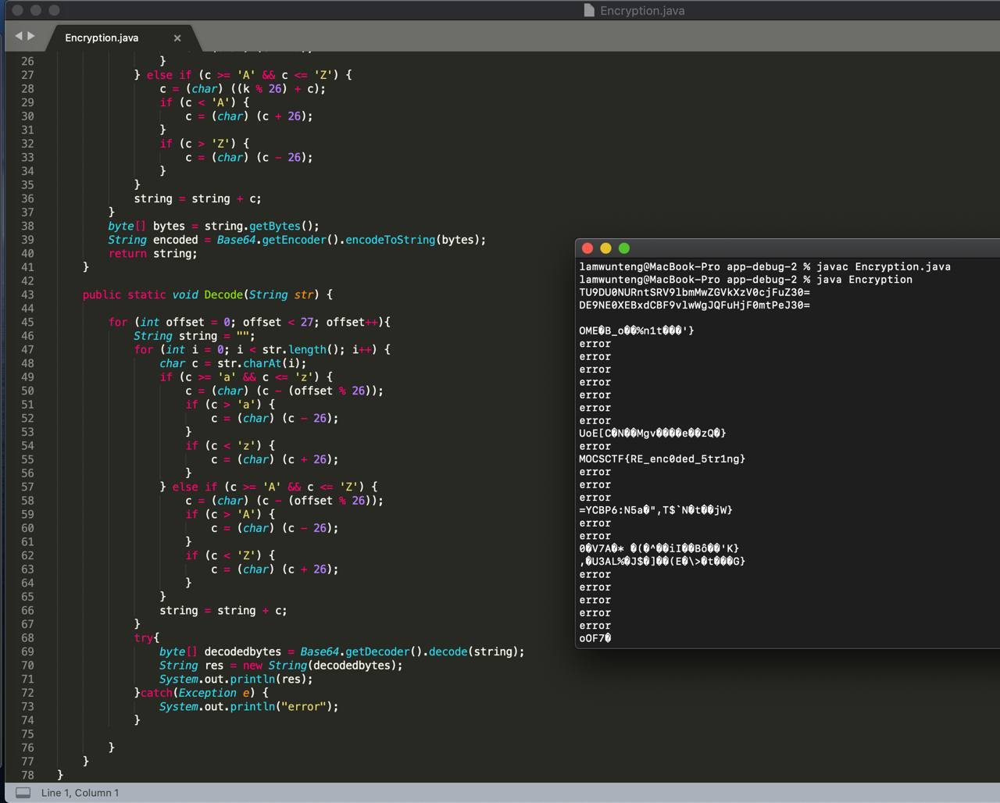

# UMCTF2021 - flagCheck

- Write-Up Author: bluebear \[[MOCTF](https://www.facebook.com/MOCSCTF)\]

- Flag:MOCSCTF{RE_enc0ded_5tr1ng}

## **Question:**
flagCheck

[flagCheck](./app-flagCheck.zip)

## Write up

---

* Use jadx to reverse apk file
* Review the java code, the flag is encrypted. The file 'encryption.java' described how does the encryption work.

>DE9NE0XEBxdCBF9vlwWgJQFuHjF0mtPeJ30=

* Reverse the encryption code, here is the resolve code.
```java
    public static void Decode(String str) {    
        for (int offset = 0; offset < 27; offset++){
        	String string = "";
	        for (int i = 0; i < str.length(); i++) {
	            char c = str.charAt(i);
	            if (c >= 'a' && c <= 'z') {
	                c = (char) (c - (offset % 26));
	                if (c > 'a') {
	                    c = (char) (c - 26);
	                }
	                if (c < 'z') {
	                    c = (char) (c + 26);
	                }
	            } else if (c >= 'A' && c <= 'Z') {
	            	c = (char) (c - (offset % 26));
	                if (c > 'A') {
	                    c = (char) (c - 26);
	                }
	                if (c < 'Z') {
	                    c = (char) (c + 26);
	                }
	            }
	            string = string + c;
	        }
	        try{
	        	byte[] decodedbytes = Base64.getDecoder().decode(string);
		        String res = new String(decodedbytes);
		        System.out.println(res);
	        }catch(Exception e) {
			  	System.out.println("error");
			}
	        
        }
    }
```
* After decryped, you will get the flag **MOCSCTF{RE_enc0ded_5tr1ng}**  
