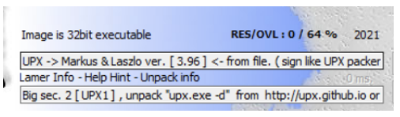
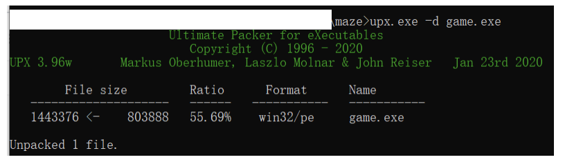
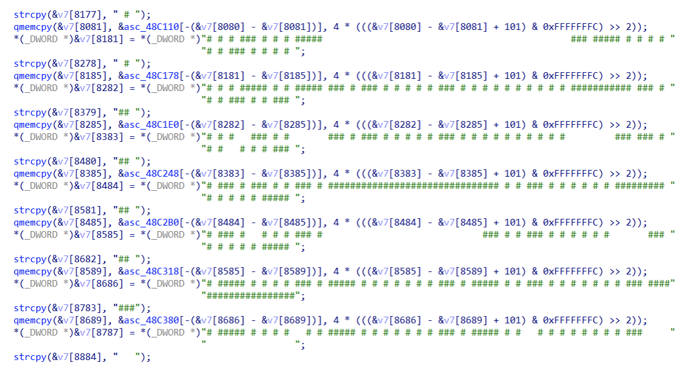
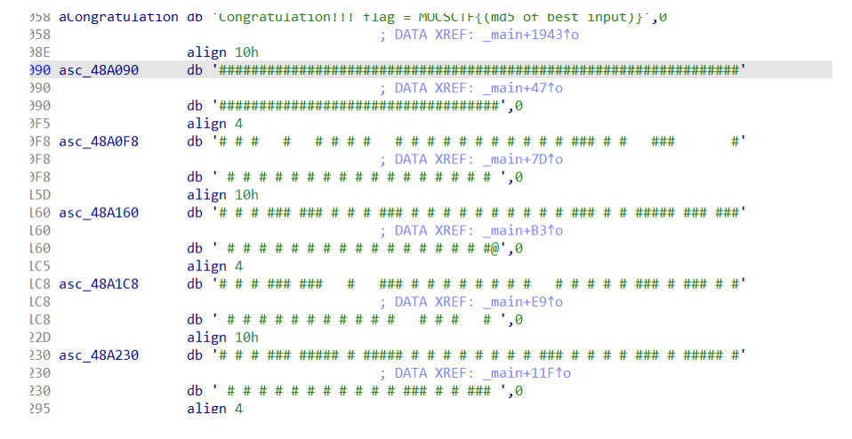

# UMCTF2021 - maze

- Write-Up Author: James \[[Merak天璇 20级](https://we.buptmerak.cn/)\]

- Flag:MOCSCTF{ca0366ebf47cae250a8995a2cab459bf}

## **Question:**
maze  
[maze.exe](./maze.exe)
## Write up

---

ctf⽐赛中经典的迷宫题⽬，此题把难度升级了⼀点⽽已，把地图变⼤了，⽽且upx压缩了⼀下，详细的wp
可参考https://www.cnblogs.com/blackicelisa/p/12263625.html  
  
放进exeinfope，32位exe，upx加壳了，upx.exe -d game.exe指令脱壳  
  
⽤ida打开，发现是maze题⽬（这不废话么，题⽬都讲了），找到地图  
  
找到地图变量位置  
  

然后按alt+L键⽅便选取，选取数据完成后按shift+E导出数据，导出完后发现会有\x00\x00\x00\x00，
这不刚好⽅便⽤软件替换吗（善⽤替换功能，防⽌⼿残了），替换后⽤⼴搜算法⼀搜就出来了  
[map](./map.txt)  
具體解題代碼請參照[solve.cpp](./solve.cpp)  
解出路径为：
DDDDDDDDDDDDWWWWDDDDDDDDDDDDDDDDDDDDDDDDDDDDWWDDDDDDDDWWDDWWDDDDDDWWDDDDDDDDDDDDDDDDDDDDDDDDDDDDWWWWWWWWWWWWWWDDWWWWWWWWWWWWWWDDWWWWWWWWWWWWWWWWWWWWWWWWWWDDDDWWDDDDDDWWWWWWW
