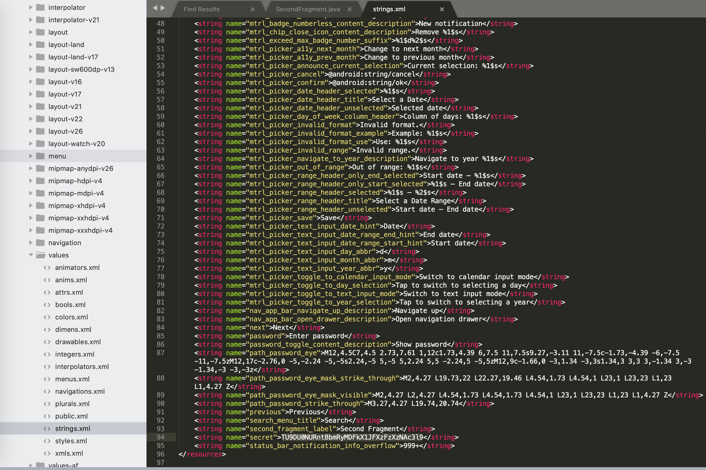

# UMCTF2021 - z00m

- Write-Up Author: bluebear \[[MOCTF](https://www.facebook.com/MOCSCTF)\]

- Flag:MOCSCTF{Andr01d_RE_1s_3@sy}

## **Question:**
z00m

[app-z00m.zip](./app-z00m.zip)

## Write up

---
* Use jadx to reverse apk file
* Review the java code, there are two page, the first page is for input the password, the second page will show the serect
* One way to resolve the challenge
1. Find out the password 'N0n-Gue33@b1e-P@55w0rd' from FirstFragment.java
2. Run the apk on Android Emulator, input the password on APP interface.
3. Get the base64 serect.

* Another way to resolve the challenge
1. Find the serect form Strings.xml directly.

* After decoded, you will get the flag **MOCSCTF{Andr01d_RE_1s_3@sy}**
