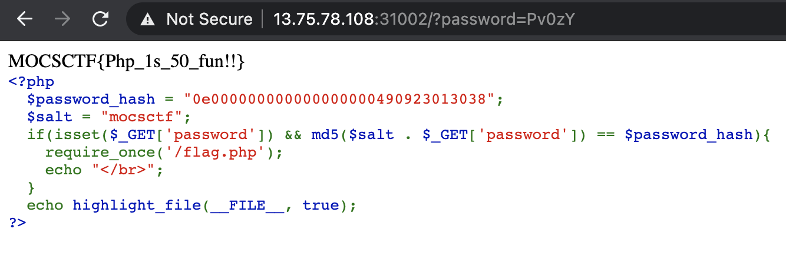

# UMCTF2021 - compair

- Write-Up Author: T4rn \[[MOCTF](https://www.facebook.com/MOCSCTF)\]

- Flag:MOCSCTF{Php_1s_50_fun!!}

## **Question:**
compair

```php
<?php
  $password_hash = "0e000000000000000000490923013038";
  $salt = "mocsctf";
  if(isset($_GET['password']) && md5($salt . $_GET['password']) == $password_hash){
    require_once('/flag.php');
    echo "</br>";
  }
  echo highlight_file(__FILE__, true);
?>
```

## Write up

**reference:**  
[PHP magic hash](https://www.whitehatsec.com/blog/magic-hashes/) - PHP programmers have been wrestling with the equals-equals (==) operator. It’s caused a lot of issues.  

---


看到==弱比较 和md50e开头纯数字我们就知道，很容易找到一个md5和$password_hash相等

这题有趣的是他拼接了一个salt，所以我们直接写脚本来find it,

```python
from itertools import product
import hashlib 
for x in range(0, 10): 
        for combo in product("abcdefghijklmnopqrstuvwxyzABCDEFGHIJKLMNOPQRSTUVWXYZ0123456789", repeat=x):
                result = hashlib.md5("mocsctf" + ''.join(combo)).hexdigest()
                if result.startswith("0e") and result[2:].isdigit():
                        print "mocsctf" + ''.join(combo)
                else:
                        pass
#mocsctfPv0zY  
#--- 676.12 seconds ---  
```
