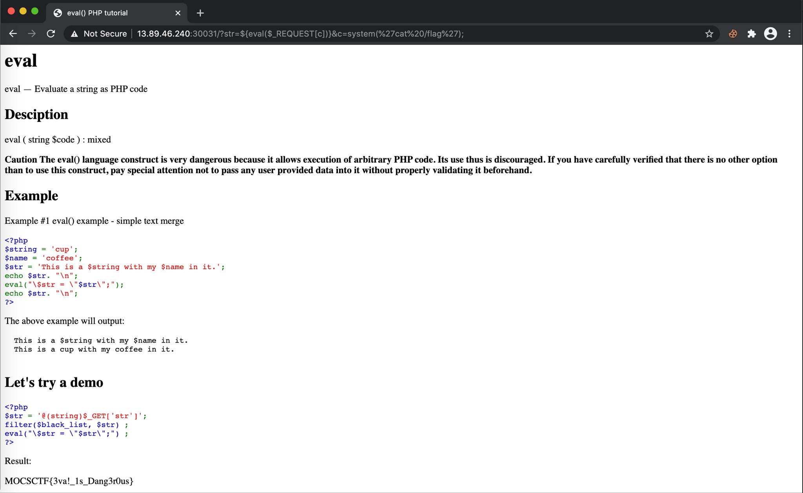

# UMCTF2021 - eval-tutorial

- Write-Up Author: bluebear \[[MOCTF](https://www.facebook.com/MOCSCTF)\]

- Flag:MOCSCTF{3va!_1s_Dang3r0us}

## **Question:**
eval-tutorial


## Write up

---

* Part of source code is provided, we have to bypass the blacklist filter.
* After we tested, the blacklist are single/double quotation marks.
* To bypass it, we can create one more PHP global variable which is used to submit data. That variable will not apply any filter.
* From eval to execute PHP code
```
?str=${eval($_REQUEST[c])}&c=system(%27cat%20/flag%27);
```
* you will get the flag **MOCSCTF{3va!_1s_Dang3r0us}**
