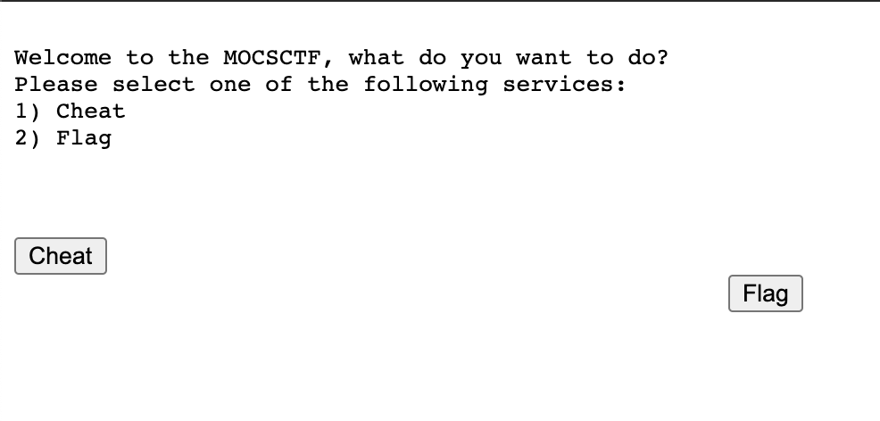
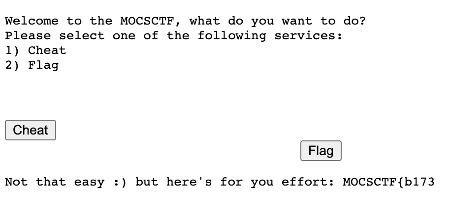
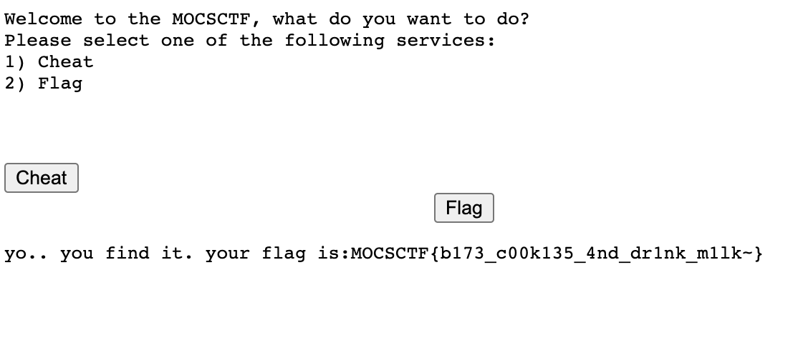

# UMCTF2021 - noobs_click

- Write-Up Author: RB916120 \[[MOCTF](https://www.facebook.com/MOCSCTF)\]

- Flag:MOCSCTF{b173_c00k135_4nd_dr1nk_m1lk~}

## **Question:**
noobs_click

## Write up

---

1. the flag button is moving. 
  
2. inspect the src code.
```javascript
  f.mousemove(function(){
       var r = Math.random()*100;
       if (r < 25)
           f.css("margin-left", "+=100px");
       else if (r >= 25 && r < 50)
           f.css("margin-left", "-=30px");
       else if (r >= 50 && r < 75)
           f.css("margin-top", "+=50px");
       else if (r >= 75 && r < 97)
           f.css("margin-top", "-=50px");
       else
           f.remove();
   })
```
3. we can use browser console to click the button.
```javascript
document.getElementById("flag").click();
```
4. show apart of flag.
  
look at src code again, this will insert a cookies on my browser and triger server give me apart of flag.
```javascript
   $("#flag").click(function(){
       console.log("TODO: Backend_enable");
       document.cookie = "clicked_flag=tru3";
       location.reload();
   });
```

5. insert Backend_enable=tru3
```javascript
document.cookie = "Backend_enable=tru3";
```

6. refresh and get the flag
