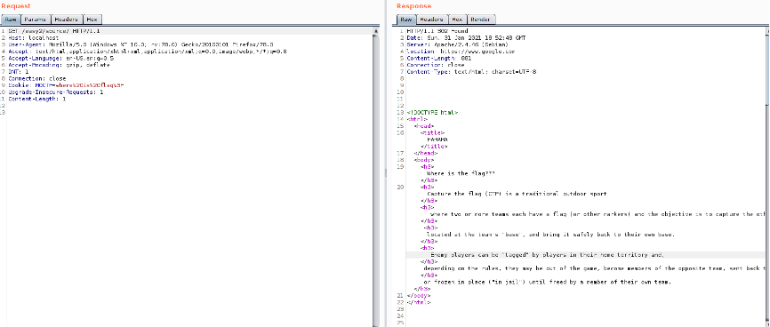
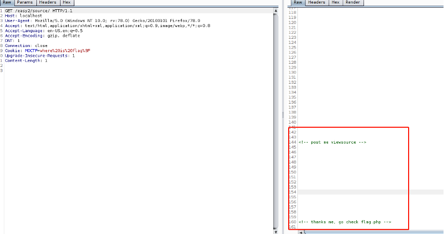
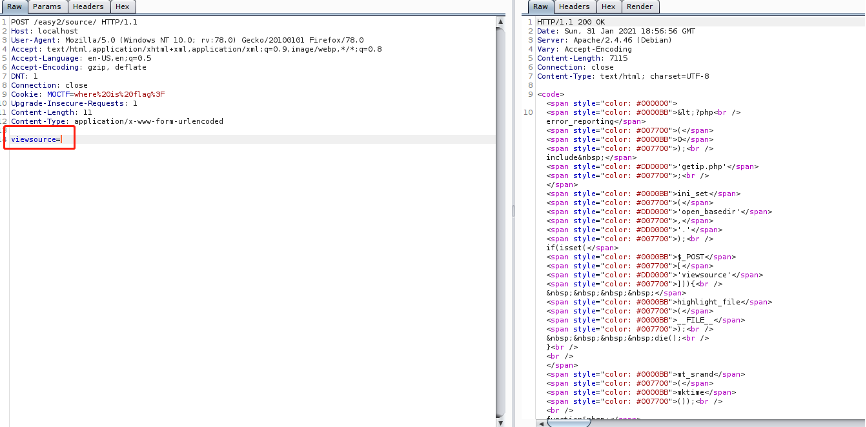
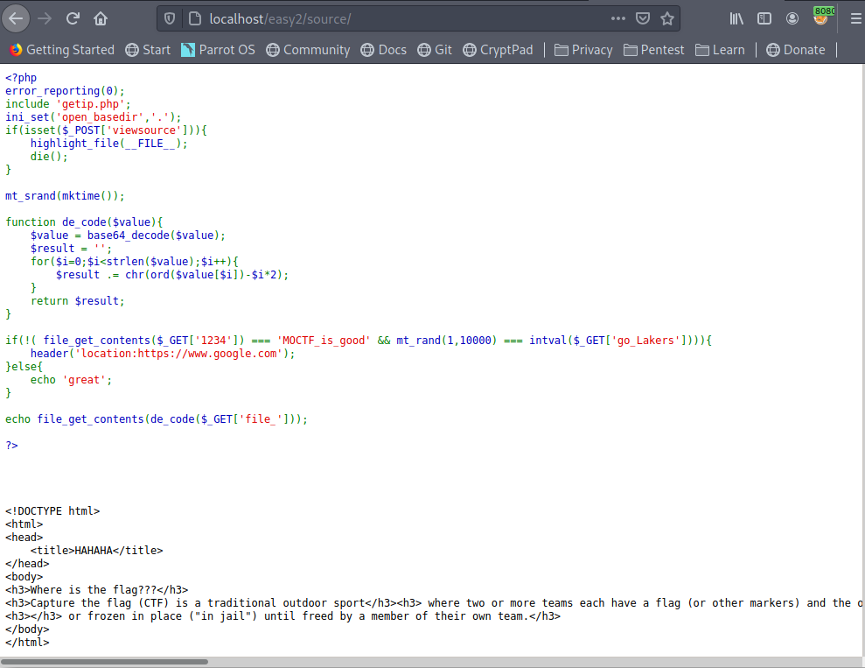
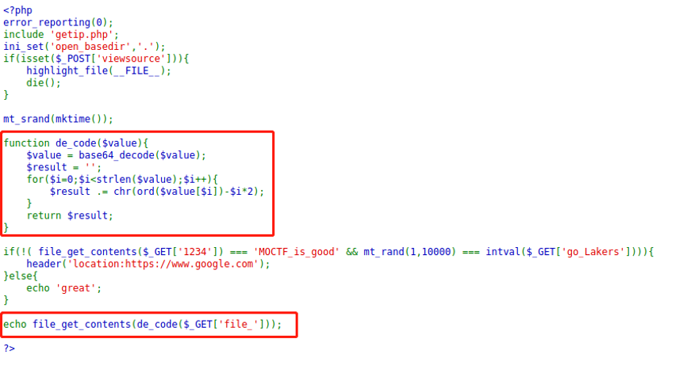
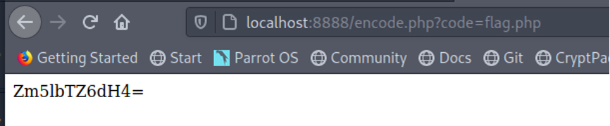
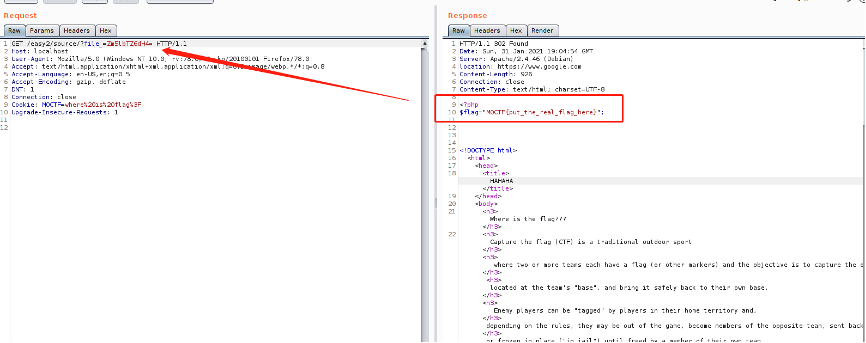

# UMCTF2021 - path2funny

- Write-Up Author: danniel@Boardware

- Flag:MOCSCTF{b16_7h4nk5_70_Boardware_XD!!}

## **Question:**
path2funny

## Write up

---

目錄下會有flag.php和index.php  
讓參賽者訪問會跳轉到google  
參賽者capture request會看到網頁回應   

 
仔細查看最下面會有兩行提示  
  

第一個提示讓參賽者用POST request 取得源碼以進行代碼審計  
第二個提示讓參賽者得知有flag.php

參賽者能以viewsource參數得出源碼 
  
   
仔細查看源碼得知網頁會輸出文件內容，而且從提示也應得知有flag.php, 因此只需取出flag.php的內容，但因為有de_cde存在，因此需要事先encode好才能正確取出flag.php的內容  
  
根據de_code編寫en_code
```php
<?php

function en_code($value){

    $result = '';
    for($i=0;$i<strlen($value);$i++){
        $result .= chr(ord($value[$i])+$i*2);

    }
    $value = base64_encode($result);
    return $value;
}

echo en_code($_GET['code']);

?>
```
Encode  flag.php 得出一個base64
 

根據源碼參數輸入最終得出flag


MOCSCTF{b16_7h4nk5_70_Boardware_XD!!}